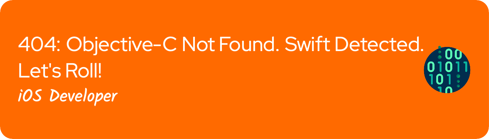

# 💫 About Me:

Experienced Lead iOS Developer with over 10 years of experience in developing iOS apps in Swift, SwiftUI, and Objective-C.

## 💻 Tech Stack:

## 🏆 GitHub Trophies

## 📊 GitHub Stats:

